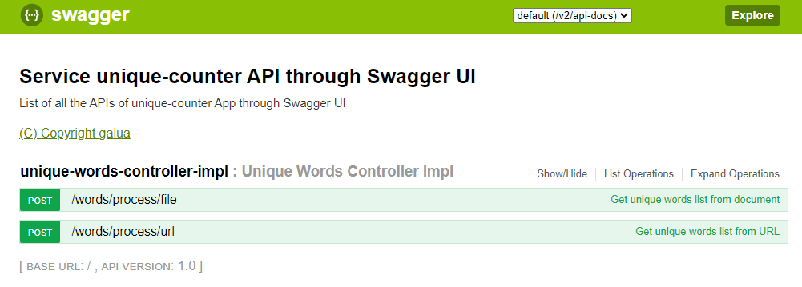

# unique-counter

## Table of contents
- [Overview](#Overview)
- [Documentation](#Documentation)
- [Git info](#Git-info)
- [Local development and installation](#Local-development-and-installation)
- [Testing](#Testing)
- [Other useful info](#Other-useful-info)
	- [Logs](#Logs)
	- [Repository link](#Repository-link)

## Overview
An application that allows to display
statistics on the number of unique words in the console for an HTML page.

## Documentation
* Task text: [link](media/task_description.pdf)
* Spring Boot documentation: [link](https://spring.io/projects/spring-boot)

## Git info
* For each issue, a separate branch is created with the name "feature/[name_of_feature]" (without []);
* After the work is completed, a pull request is created to the master branch;
* Make sure that all CI & CD validations are passed successful.

## Local development and installation
* Check you have Java 8 installed
* Open project from your IDE and start development
* Or you can build project type commands
```
mvn clean package
```
* Run Spring Boot service
```
cd target
java -jar unique-counter-0.0.1-SNAPSHOT.jar
```
You can check the contracts of service via Swagger. Type in browser
```
http://localhost:8080/swagger-ui.html
```
At screen below you can see app endpoints: 



## Testing
You can run app tests by command
```
mvn test
```

## Other useful info

### Logs
Logging configured via log4j2 library.
Config placed by path: `src/main/resources/log4j2.xml`

Application store 3 types of logs in files:
1. `logs/app-debug.log` - logs with DEBUG level
2. `logs/app-info.log` - logs with INFO level. Store information about application execution
3. `logs/app-error.log` - logs with ERROR level. Store application errors and unexpected exceptions

### Repository link
You can check my github repository by [link](https://github.com/selutin99/unique-counter)